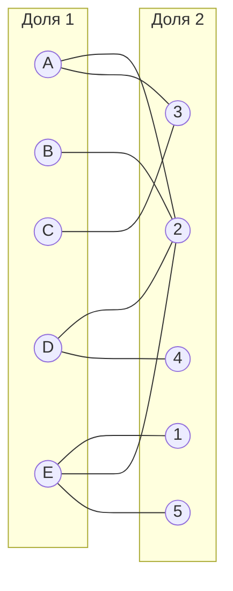
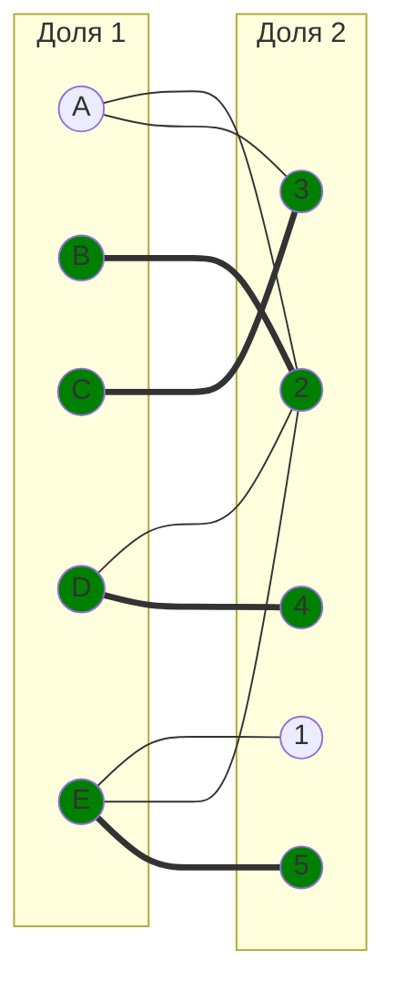
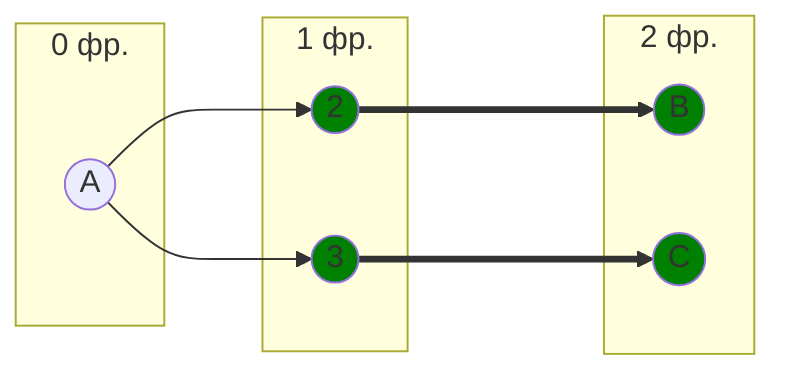
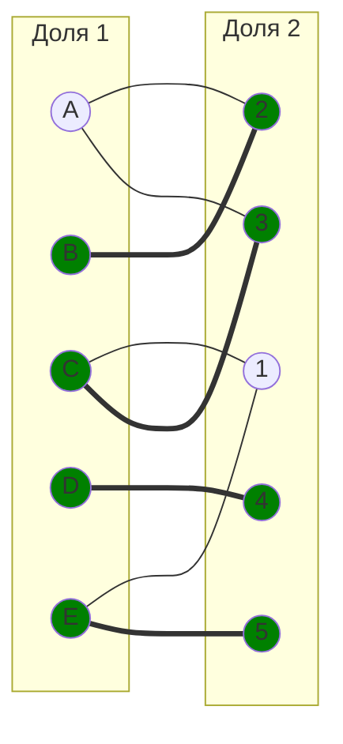
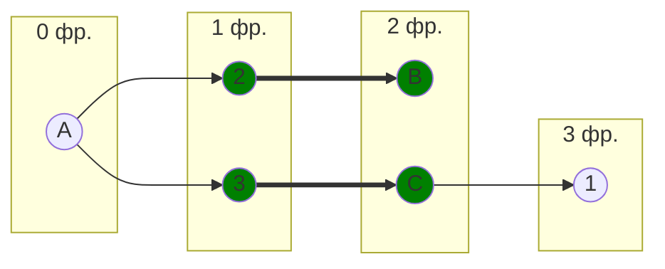
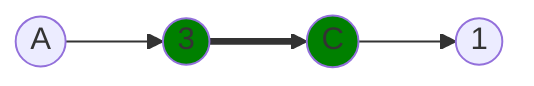
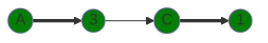
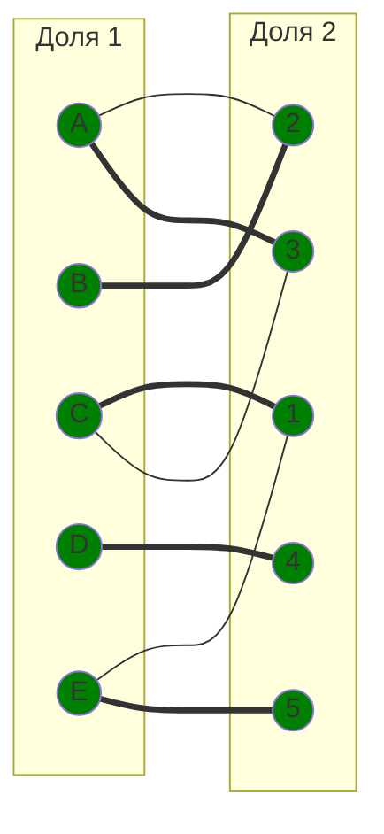

## Задача о назначении. Венгерский алгоритм. Вариант 5
Для выполнения задания необходимо: 
1. Решить задачу о назначении с использованием Венгерского алгоритма
2. Оформить решение задачи по шагам с подробными комментариями, таблицами и диаграммами.
3. В ответе указать минимальную сумму затрат на выполнение всех заданий.
4. В ответе вывести найденные назначения

Дана матрица затрат для задач A, B, C, D, E и исполнителей 1, 2, 3, 4, 5:

|       | **1** | **2** | **3** | **4** | **5** |
|-------|:-----:|:-----:|:-----:|:-----:|:-----:|
| **A** |  15   |   7   |   7   |  12   |  12   |
| **B** |  15   |   5   |  14   |  14   |  11   |
| **C** |  11   |  12   |   5   |  11   |   7   |
| **D** |  14   |   5   |  12   |   6   |   6   |
| **E** |  13   |   8   |  13   |  15   |   8   |

1. Проведем редукцию матрицы затрат. Вычтем из каждой строки минимальное значение, представленное в этой строке.

|       | **1** | **2** | **3** | **4** | **5** | **Min** |
|-------|:-----:|:-----:|:-----:|:-----:|:-----:|:-------:|
| **A** |   8   |   0   |   0   |   5   |   5   |    7    |
| **B** |  10   |   0   |   9   |   9   |   6   |    5    |
| **C** |   6   |   7   |   0   |   6   |   2   |    5    |
| **D** |   9   |   0   |   7   |   1   |   1   |    5    |
| **E** |   5   |   0   |   5   |   7   |   0   |    8    |

После чего вычтем из каждого столбца минимальное значение, представленное в этом столбце.

|         | **1** | **2** | **3** | **4** | **5** | **Min** |
|-------  |:-----:|:-----:|:-----:|:-----:|:-----:|:-------:|
| **A**   |   3   |   0   |   0   |   4   |   5   |    7    |
| **B**   |   5   |   0   |   9   |   8   |   6   |    5    |
| **C**   |   1   |   7   |   0   |   5   |   2   |    5    |
| **D**   |   4   |   0   |   7   |   0   |   1   |    5    |
| **E**   |   0   |   0   |   5   |   6   |   0   |    8    |
| **Min** |   5   |   0   |   0   |   1   |   0   |         |

Получим редуцированную матрицу, где нули обозначают наименее затратные варианты назначений.

|         | **1** | **2** | **3** | **4** | **5** |
|-------  |:-----:|:-----:|:-----:|:-----:|:-----:|
| **A**   |   3   |   0   |   0   |   4   |   5   |
| **B**   |   5   |   0   |   9   |   8   |   6   |
| **C**   |   1   |   7   |   0   |   5   |   2   |
| **D**   |   4   |   0   |   7   |   0   |   1   |
| **E**   |   0   |   0   |   5   |   6   |   0   |

2. Построим двудольный граф, вынесем на него те ребра, для которых в редуцированной матрице указаны нули.

Выберем произвольное паросочетание $[B, 2]$, $[C, 3]$, $[D, 4]$, $[E, 5]$ и попытаемся построить совершенное паросочетание с помощью чередующихся деревьев.

Попытаемся построить дерево из оставшейся непокрытой вершины A.

В построенном дереве нет цепей, чередующееся относительно текущего паросочетания, обе ветки закончились в покрытых вершинах, то есть в указанном графе нет совершенного паросочетания.

3. Проведем повторную редукцию матрицы затрат.

Во множество X выпишем все **покрытые построенным деревом** вершины первой доли графа, во множество Y все **покрытые построенным деревом** вершины из второй доли графа.

$$
X = \{A, B, C\}
$$

$$
Y = \{2, 3 \}
$$

Необходимо найти минимальный элемент из строк, включенных во множество X и столбцов, не включенных во множество Y. В нашем случае это будут строки A, B, C и столбцы 1, 4, 5. Минимальный элемент 1, расположен в строке C и столбце 1. 

Вычтем найденное значение из строк множества X и прибавим к столбцам множества Y:

|       | **1** | **2** | **3** | **4** | **5** |       |
|-------|:-----:|:-----:|:-----:|:-----:|:-----:|:-----:|
| **A** |   2   |   0   |   0   |   3   |   4   |  -1   |
| **B** |   4   |   0   |   9   |   7   |   5   |  -1   |
| **C** | **0** |   7   |   0   |   4   |   1   |  -1   |
| **D** |   4   | **1** |   8   |   0   |   1   |       |
| **E** |   0   | **1** |   6   |   6   |   0   |       |
|       |       |   +1  |   +1  |       |       |       |

В ячейке C1 появилось новое нулевое значение, добавим соответствующее ребро в двудольный граф. В ячейках D2 и E2 пропали нулевые значения, уберем соответствующие ребра из двудольного графа.

4. Попытаемся построить совершенное паросочетание с помощью чередующихся деревьев.

Построенное дерево содержит чередующуюся, относительно текущего паросочетания, цепь A3 - 3C - C1 начинается и заканчивается в непокрытых вершинах, все ребра в цепи чередуются по вхождению в текущее паросочетание.

"Перекрасим" найденную цепь и проверим полученное паросочетание.

Полученное расписание является совершенным. Выпишем полученные назначения и их стоимости из исходной матрицы:
- C1 - 11
- B2 - 5
- A3 - 7
- D4 - 6
- E5 - 8

Общая стоимость затрат = 11 + 5 + 7 + 6 + 8 = 37.

## Ответ
Минимальная стоимость затрат 37, при следующих назначениях:
- задача C, исполнитель 1,
- задача B, исполнитель 2,
- задача A, исполнитель 3,
- задача D, исполнитель 4.
- задача E, исполнитель 5.

