# Задание №17
# Задача о максимальном потоке минимальной стоимости.
Для каждого варианта представлены условия задачи, в соответствии с которыми необходимо: 
1. Построить сеть с указанием пропускной способности дуг.
2. Построить остаточную сеть.
3. Определить максимальный поток методом поиска увеличивающих путей в остаточной сети (**строго** так, как было разобрано на занятиях).
4. Минимизировать стоимость максимального потока посредством поиска циклов отрицательной стоимости (**решение необходимо построить так, чтобы найти и обработать как минимум один цикл отрицательной стоимости**).
5. Оформить решение задачи по шагам с подробными комментариями, таблицами и диаграммами.
6. В ответе указать максимальную величину потока, минимальную стоимость транспортировки и сеть с указанием соответствующих локальных потоков.

### Вариант 5:
#### Пропускная способность дуг сети p(e) и стоимость транспортировки  единицы потока c(e):

| Дуги                                          | sa | sb | ab | ad | ac | cd | bd | dt | bc |
|:----------------------------------------------|:--:|:--:|:--:|:--:|:--:|:--:|:--:|:--:|:--:|
| Пропускная способность p(e)                   | 10 | 10 | 6  | 6  | 6  | 12 | 6  | 15 | 5  |
| Стоимость транспортировки единицы потока c(e) | 1  | 1  | 1  | 3  | 1  | 5  | 7  | 1  | 1  |

## Решение

### 1. Построим сеть с источником **s**, стоком **t** и указанными пропускными способностями дуг.

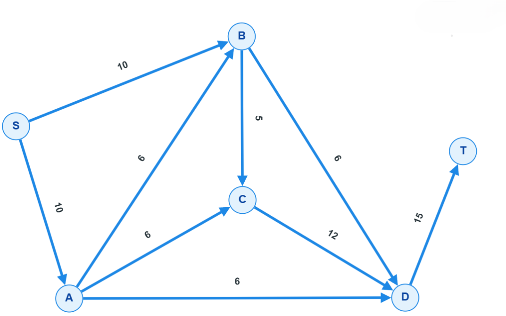

Построим остаточную сеть. Так как изначально поток в сети не задан, все дуги сети являются пустыми (локальный поток равен нулю), соответственно в остаточную сеть необходимо вынести обратную дугу с весом равным пропускной способности.

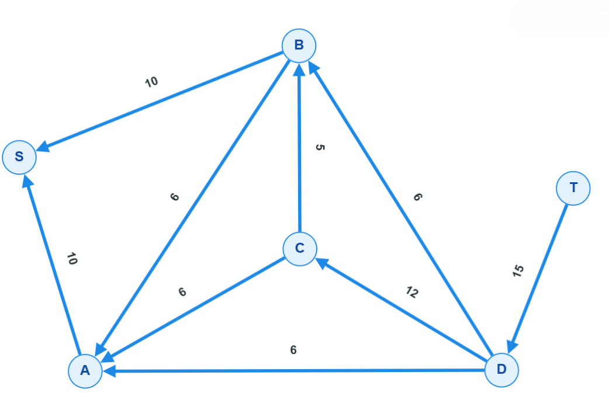

### 2. Проведем поиск увеличивающего пути в остаточной сети
В остаточной сети найден увеличивающий путь t -> d -> a -> s. Минимальный вес дуг на этом пути равен 6.

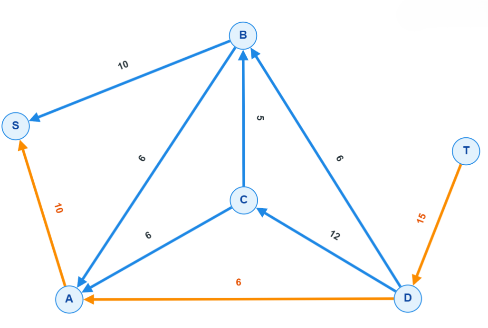

Уменьшим вес дуг на найденном пути, дуги для которых вес стал нулевым удалим из остаточной сети.

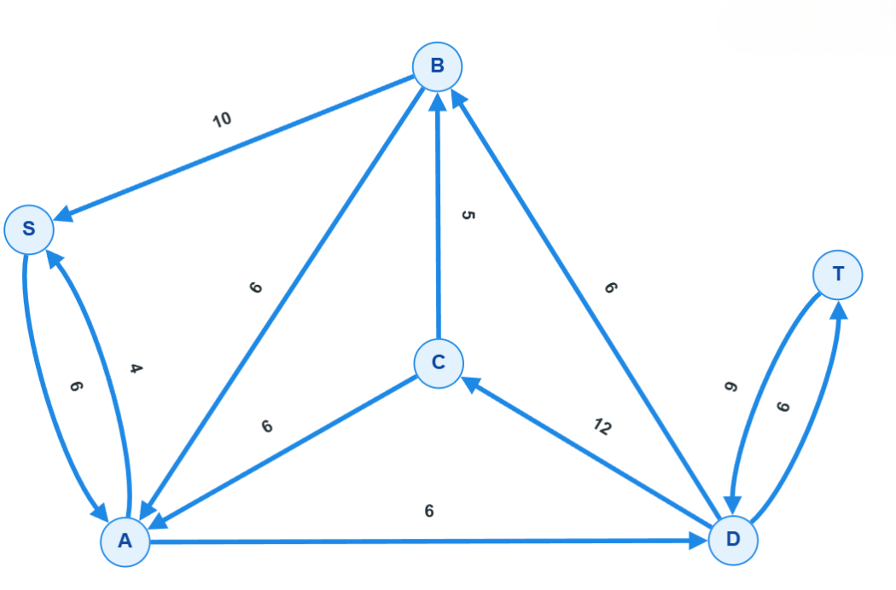

Скорректируем соответствующим образом локальные потоки в исходной сети. Первым числом будем указывать локальный поток, вторым пропускную способность дуги.

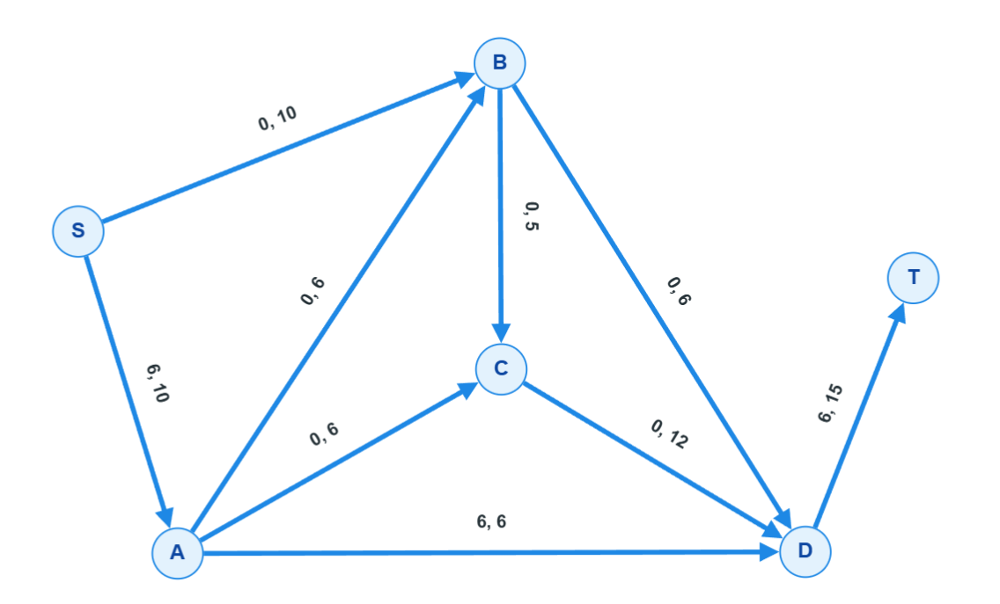

### 3. Продолжим поиск увеличивающего пути в остаточной сети

В остаточной сети найден увеличивающий путь t -> d -> b -> s. Минимальный вес дуг на этом пути равен 6.

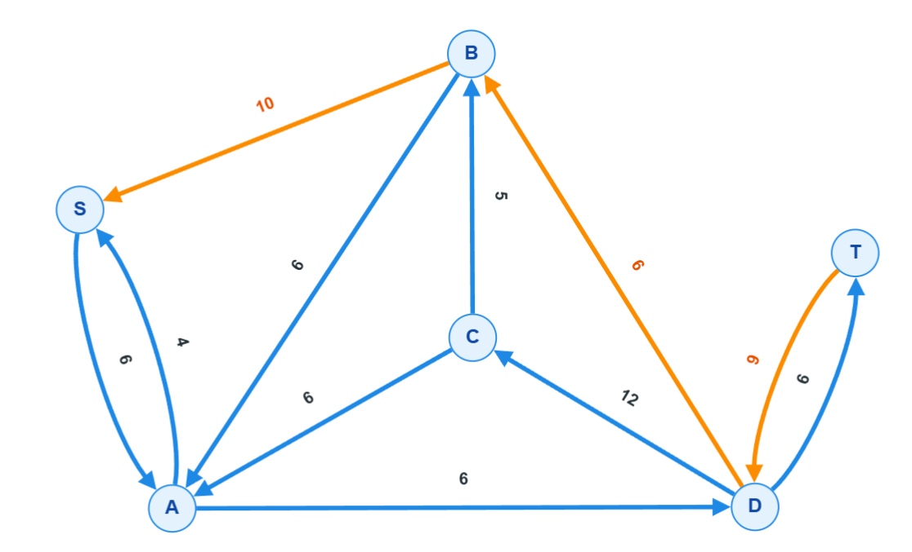

Уменьшим вес дуг на найденном пути, дуги для которых вес стал нулевым удалим из остаточной сети.

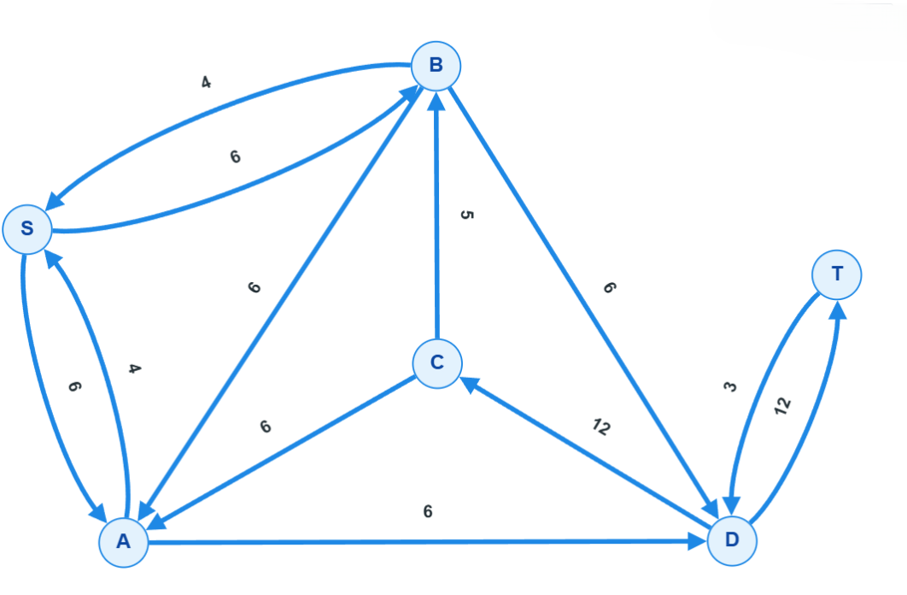

Скорректируем соответствующим образом локальные потоки в исходной сети.

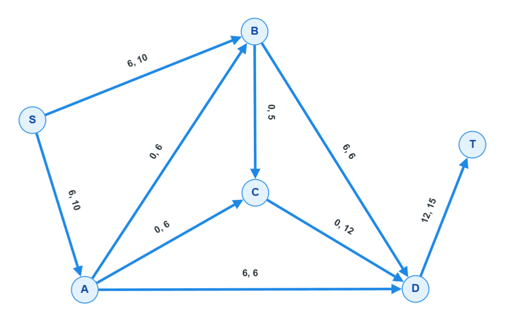

### 4. Продолжим поиск увеличивающего пути в остаточной сети

В остаточной сети найден увеличивающий путь t -> d -> с -> b -> s. Минимальный вес дуг на этом пути равен 3.

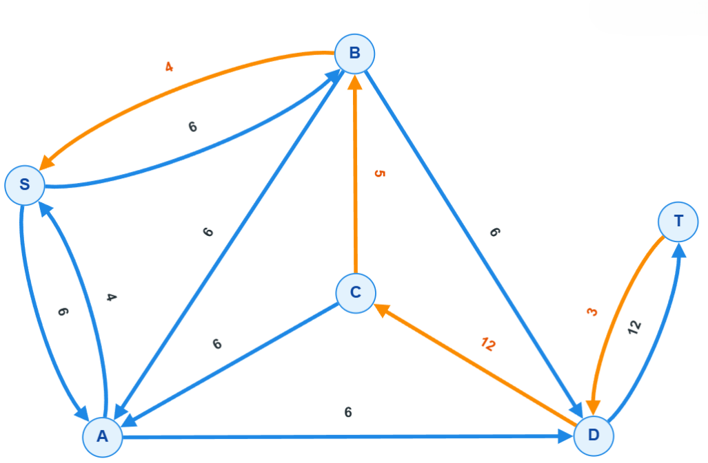

Уменьшим вес дуг на найденном пути, дуги для которых вес стал нулевым удалим из остаточной сети.

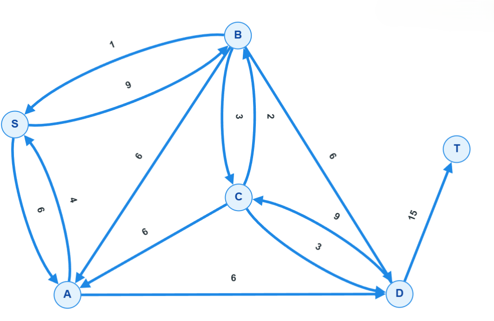

Скорректируем соответствующим образом локальные потоки в исходной сети.

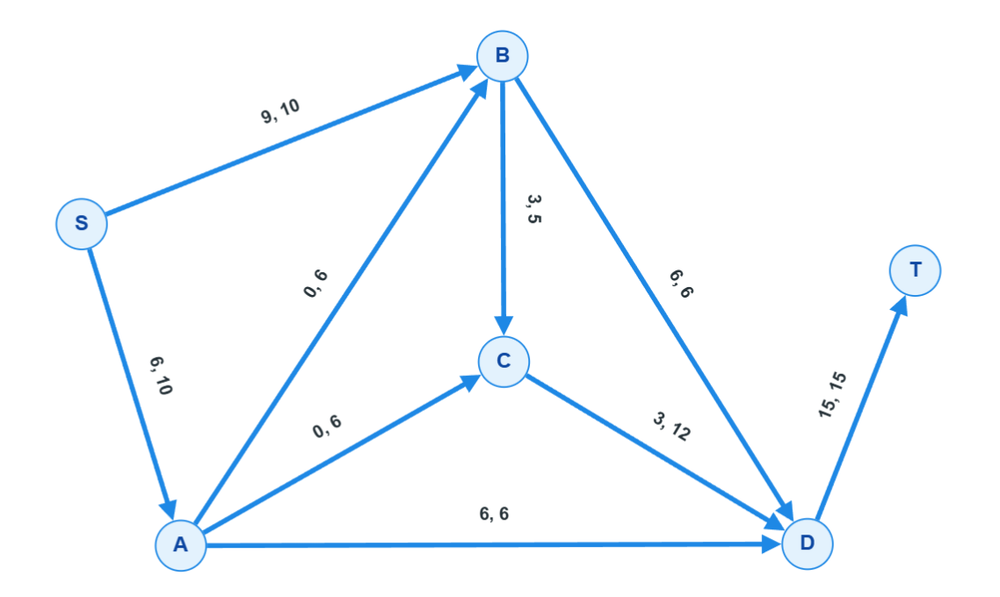

### 5. Продолжим поиск увеличивающего пути в остаточной сети

В остаточной сети не найдено увеличивающих путей, следовательно, алгоритм завершил работу и найденный поток величиной 15 является максимальным для данной сети. Он реализуется следующим локальными потоками:

### 6. Минимизируeм стоимость максимального потока посредством поиска циклов отрицательной стоимости

| Дуги                                          | sa | sb | ab | ad | ac | cd | bd | dt | bc |
|:----------------------------------------------|:--:|:--:|:--:|:--:|:--:|:--:|:--:|:--:|:--:|
| Пропускная способность p(e)                   | 10 | 10 | 6  | 6  | 6  | 12 | 6  | 15 | 5  |
| Локальный поток f(e)                          | 6  | 9  | 0  | 6  | 0  | 3  | 6  | 15 | 3  |
| Стоимость транспортировки единицы потока c(e) | 1  | 1  | 1  | 3  | 1  | 5  | 7  | 1  | 1  |

$$
C=\sum _{E}c(e)\cdot f(e)=1\cdot 6+1\cdot 9+3\cdot 6+5\cdot 3+7\cdot 6+1\cdot 15+1\cdot 3=108
$$

Построим остаточную сеть

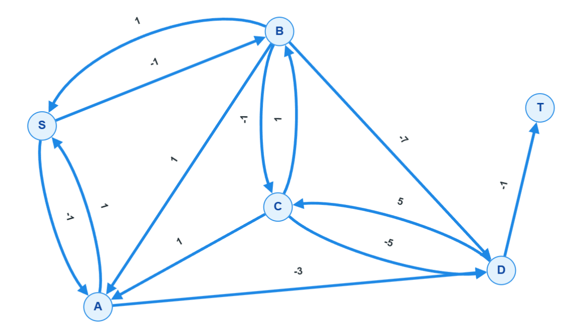

В остаточной сети найден цикл d -> c -> b -> d со стоимостью 1+5-7=-1<0.

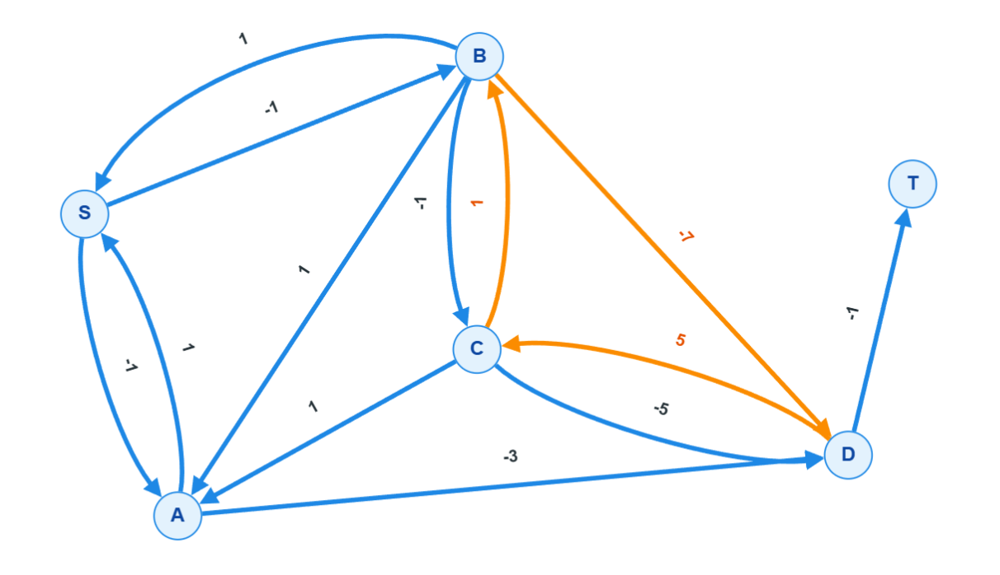

Веса дуг, образующих этот цикл, равны соответственно:
- $p(d -> c)=9$;
- $p(c -> b)=2$;
- $p(b -> d)=6$.

Таким образом, минимальный из весов дуг, образующих цикл d -> c -> b -> d, равен 2. Уменьшим на 2 веса всех этих дуг и добавим дугу d -> b с весом 2. Дугу c -> b с нулевым весом удалим из остаточной сети.

В результате получим новый локальный поток и остаточную сеть:

| Дуги                                          | sa | sb | ab | ad | ac | cd | bd | dt | bc |
|:----------------------------------------------|:--:|:--:|:--:|:--:|:--:|:--:|:--:|:--:|:--:|
| Пропускная способность p(e)                   | 10 | 10 | 6  | 6  | 6  | 12 | 6  | 15 | 5  |
| Локальный поток f(e)                          | 6  | 9  | 0  | 6  | 0  | 5  | 4  | 15 | 5  |
| Стоимость транспортировки единицы потока c(e) | 1  | 1  | 1  | 3  | 1  | 5  | 7  | 1  | 1  |

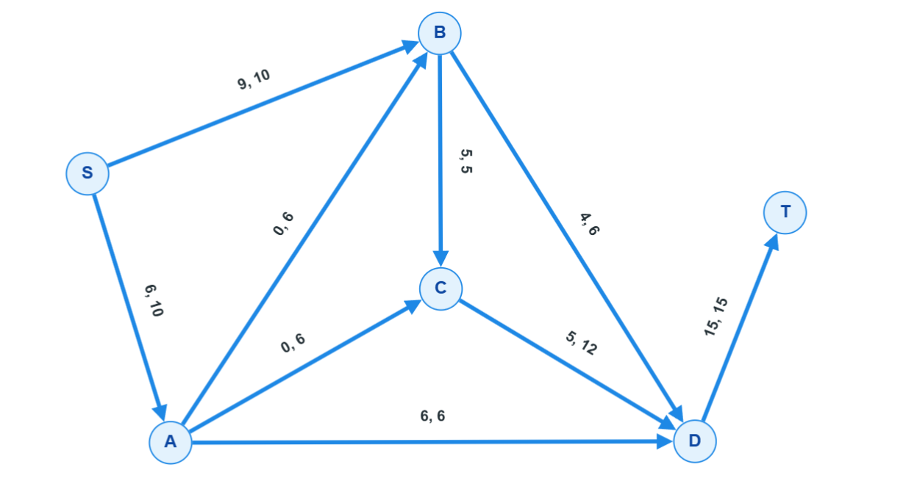
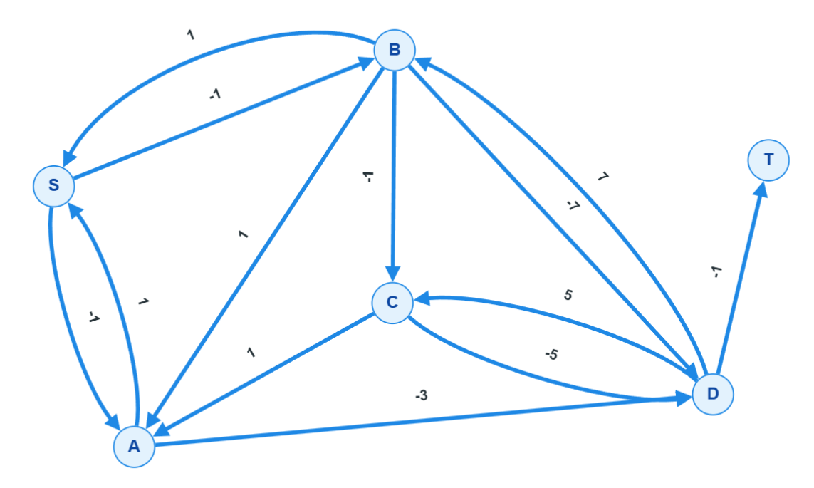

$$
C=\sum _{E}c(e)\cdot f(e)=1\cdot 6+1\cdot 9+3\cdot 6+5\cdot 5+7\cdot 4+1\cdot 15+1\cdot 5=106
$$

### 7. Продолжаем поиск циклов отрицательной стоимости

В остаточной сети найден цикл s -> b -> d -> c -> a -> s со стоимостью 1+5+1-1-7=-1<0.

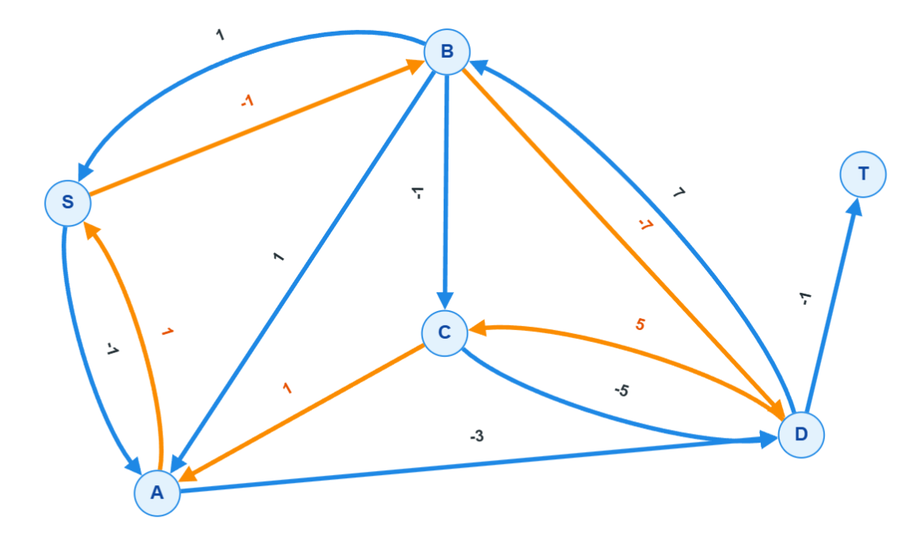

Веса дуг, образующих этот цикл, равны соответственно:
- $p(s -> b)=9$;
- $p(b -> d)=4$;
- $p(d -> c)=7$;
- $p(c -> a)=6$;
- $p(a -> s)=4$.

Таким образом, минимальный из весов дуг, образующих цикл s -> b -> d -> c -> a -> s, равен 4. Уменьшим на 4 веса всех этих дуг и добавим дугу a -> c с весом 4. Дуги a -> s и b -> d с нулевым весом удалим из остаточной сети.

В результате получим новый локальный поток и остаточную сеть:

| Дуги                                          | sa | sb | ab | ad | ac | cd | bd | dt | bc |
|:----------------------------------------------|:--:|:--:|:--:|:--:|:--:|:--:|:--:|:--:|:--:|
| Пропускная способность p(e)                   | 10 | 10 | 6  | 6  | 6  | 12 | 6  | 15 | 5  |
| Локальный поток f(e)                          | 10 | 5  | 0  | 6  | 4  | 9  | 0  | 15 | 5  |
| Стоимость транспортировки единицы потока c(e) | 1  | 1  | 1  | 3  | 1  | 5  | 7  | 1  | 1  |

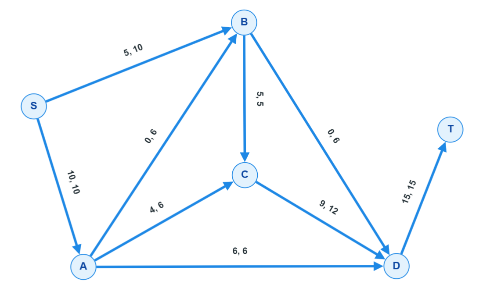
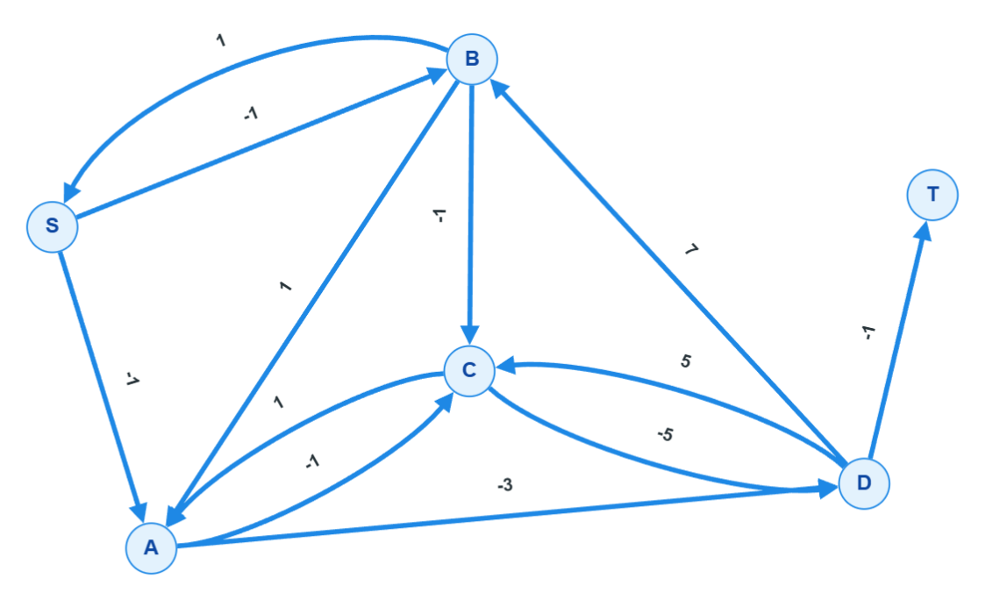

$$
C=\sum _{E}c(e)\cdot f(e)=1\cdot 10+1\cdot 5+3\cdot 6+1\cdot 4+5\cdot 9+1\cdot 15+1\cdot 5=102
$$

### 8. Продолжаем поиск циклов отрицательной стоимости

В остаточной сети найден цикл a -> d -> c -> a со стоимостью 1+5-3=3>0.

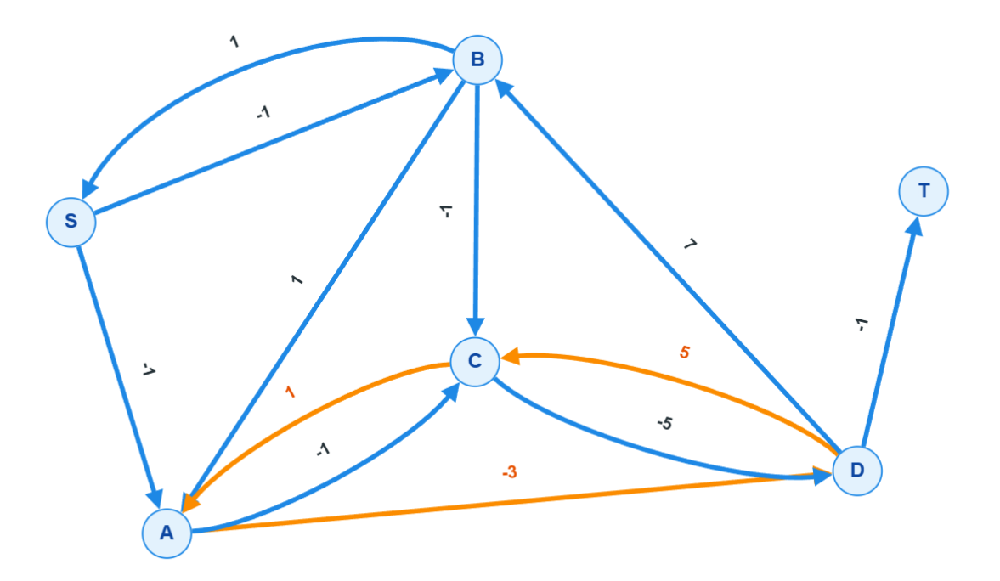

В остаточной сети найден цикл s -> a -> d -> b -> s со стоимостью 1+7-1-3=4>0..

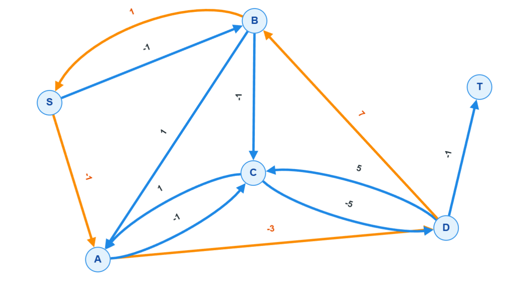

В остаточной сети найден цикл a -> d -> b -> a со стоимостью 1+7-3=5>0.

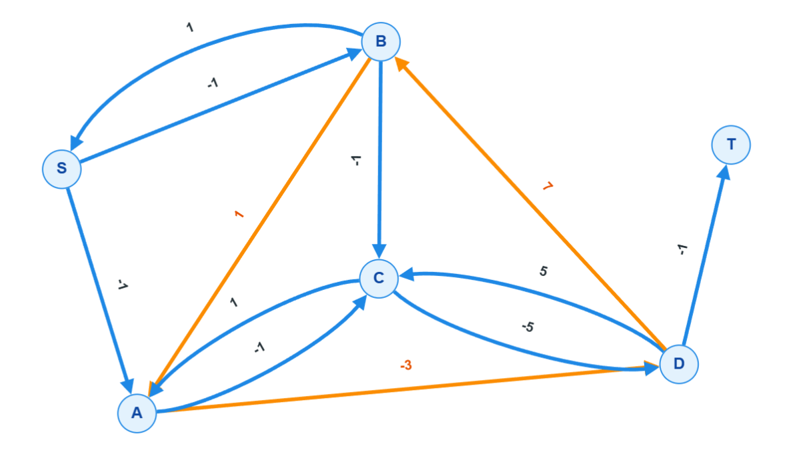

В остаточной сети найден цикл s -> a -> c -> d -> b -> s со стоимостью 1+7-1-1-5=1>0.

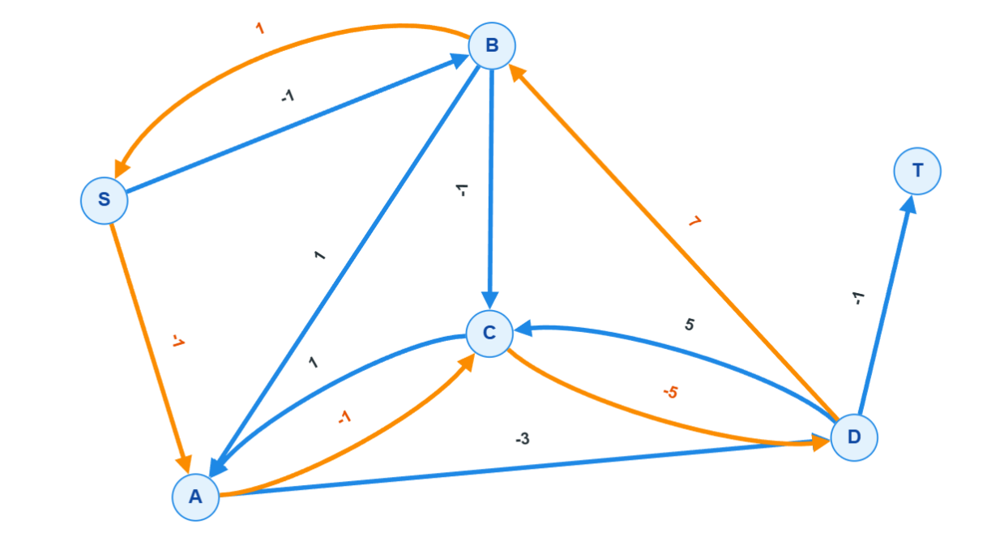

В остаточной сети найден цикл c -> d -> b -> a -> c со стоимостью 1+7-1-5=2>0.

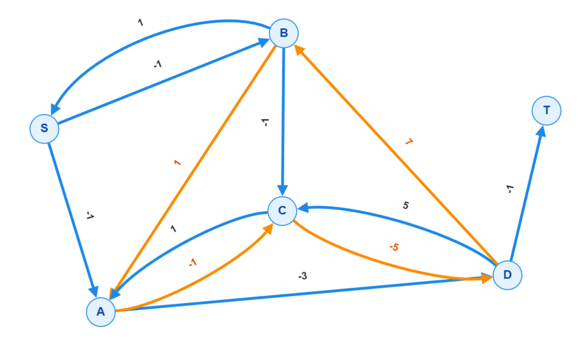

В остаточной сети найден цикл c -> d -> b -> c со стоимостью 1+5+1-1-7=-1<0.

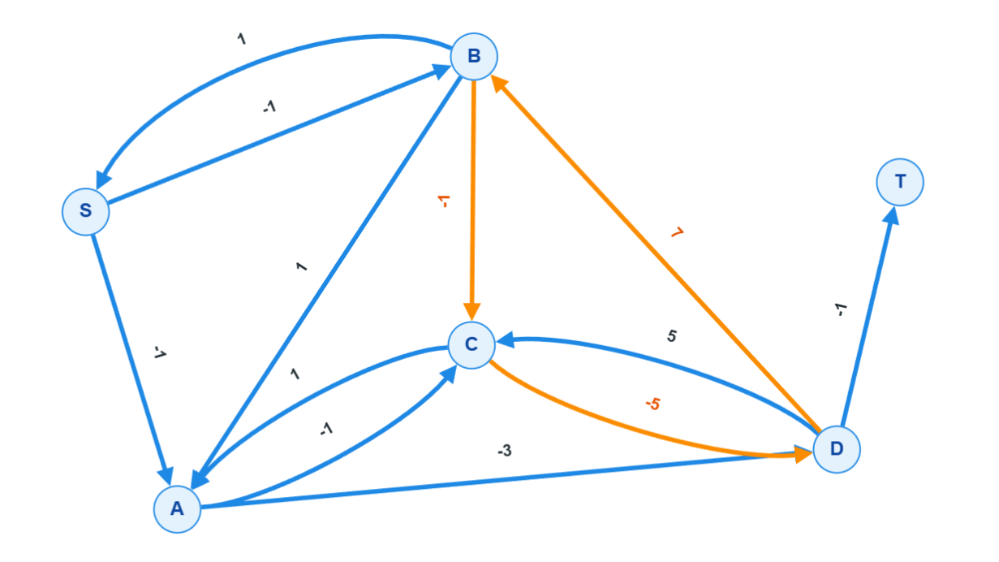

Все оставшиеся циклы имеют положительную стоимость, значит найденный поток является искомым максимальным потоком минимальной стоимости.

### Ответ:
Максимальный поток в сети равен 15, минимальная стоимость транспортировки равна 102 она реализуется следующим локальными потоками:

